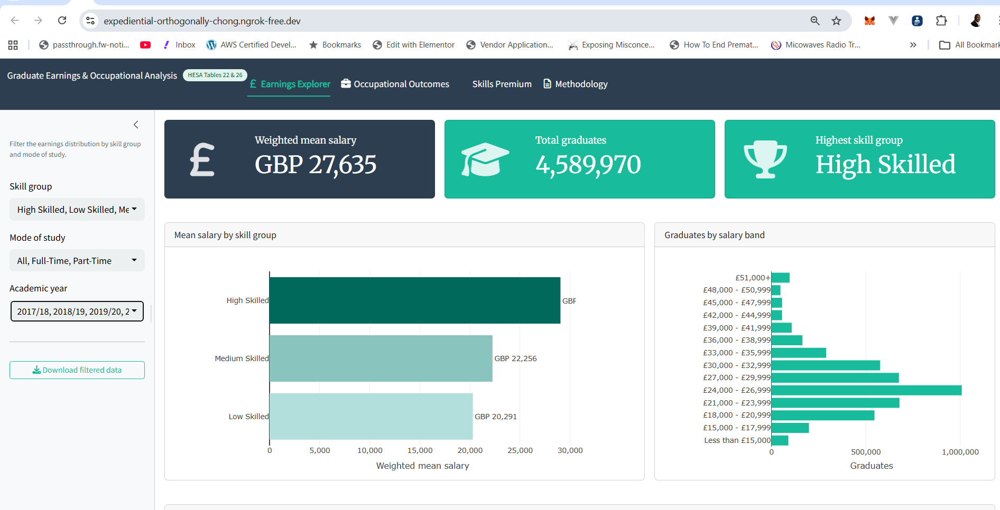

# 🎓 HESA Graduate Earnings & Occupational Analysis

<p align="center">
	
</p>

<hr style="border: 0; border-top: 1px solid #e5e7eb; margin: 1rem 0;" />

<p align="center">
	<strong>Principal Statistical Analyst Portfolio — Jisc / HESA</strong>&nbsp;
	<a href="https://gatemediang.github.io/HESA-Graduate-Earnings-R-Statistical-Analysis/">
		
	</a>
</p>

A rigorous, end-to-end R analysis linking graduate occupational outcomes (HESA Table 22) to salary distributions (HESA Table 26) across 229 UK higher education providers — culminating in a quantile regression model, interactive Shiny dashboard, and publication-quality outputs.

---

## 📌 The Problem

UK higher education policy lacks a provider-level evidence base that directly connects *what jobs graduates get* to *how much they earn*. HESA publishes occupational data (Table 22) and salary data (Table 26) separately — but no published analysis joins them to quantify the **graduate skills premium**: the salary uplift from placing graduates into professional and managerial roles (SOC major groups 1–3).

This project fills that gap.

---

## 🎯 Research Questions

1. Is there a measurable salary premium associated with higher rates of graduate-level employment at provider level?
2. Does this premium vary across the earnings distribution (i.e. is it larger for already high-earning providers)?
3. Which providers perform best and worst after controlling for national median salary?

---

## 📊 Data Sources

| Table | Description | Coverage | Link |
|-------|-------------|----------|------|
| **HESA Table 22** | Standard Occupational Classification (SOC 2020) of graduates entering UK employment, by provider | 2017/18 to 2022/23 | [↗ HESA](https://www.hesa.ac.uk/data-and-analysis/graduates/table-22) |
| **HESA Table 26** | UK graduates in full-time paid employment, by provider and salary band | 2017/18 to 2022/23 | [↗ HESA](https://www.hesa.ac.uk/data-and-analysis/graduates/table-26) |

**Population scope (both tables):** UK permanent address · First degree · Full-time paid employment in UK

### Data Dictionary

**module_b_dataset.csv** — Provider-level analytical dataset (1,205 rows)

| Column | Type | Description |
|--------|------|-------------|
| `ukprn` | integer | UK Provider Reference Number (unique ID) |
| `provider` | string | Institution name |
| `year` | string | Academic year (e.g. "2017/18") |
| `mode` | factor | Mode of study: All / Full-Time / Part-Time |
| `skill_group` | factor | High Skilled / Medium Skilled / Low Skilled |
| `total_graduates` | integer | Total graduates in scope |
| `weighted_mean_salary` | numeric | Σ(band midpoint × count) ÷ Σ(count) |
| `pct_graduate_role` | numeric | % graduates in SOC major groups 1–3 (0–1 scale) |
| `total_soc_grads` | integer | Total SOC-classified graduates |

**provider_skills_premium.csv** — Provider-level summary (229 rows)

| Column | Type | Description |
|--------|------|-------------|
| `ukprn` | integer | Provider reference number |
| `provider` | string | Institution name |
| `mean_salary` | numeric | Provider weighted mean salary (£) |
| `pct_graduate_role` | numeric | % in SOC 1–3 roles (0–100 scale) |

**quantile_regression_results.csv** — Model outputs (3 rows)

| Column | Type | Description |
|--------|------|-------------|
| `Quantile` | string | Q25 / Q50 / Q75 label |
| `Estimate (£)` | numeric | £ change in salary per 1pp increase in % SOC 1–3 |
| `CI lower (£)` | numeric | 95% confidence interval lower bound |
| `CI upper (£)` | numeric | 95% confidence interval upper bound |
| `p-value` | numeric | Statistical significance |

---

## ⚙️ Technical Stack

| Layer | Tool | Purpose |
|-------|------|---------|
| **Runtime** | Google Colab Pro | High-RAM (51GB) R kernel for full HESA microdata |
| **Data wrangling** | `tidyverse`, `janitor` | Ingestion, cleaning, joining, summarisation |
| **Statistical modelling** | `quantreg` | Quantile regression (rq) at Q25/Q50/Q75 |
| **Visualisation** | `plotly`, `ggplot2` | Interactive and publication-quality charts |
| **Dashboard** | `shiny`, `bslib`, `shinyWidgets`, `DT` | 4-tab interactive dashboard |
| **Deployment** | `processx` + ngrok binary | Background Shiny server + public HTTPS tunnel |
| **String/format** | `glue`, `scales` | Clean output formatting |

---

## 🔬 Methodology

### 1. Salary Estimation
- Salary band midpoints used as numeric outcome (true individual salaries unavailable in published HESA data)
- Open-ended upper band (£51,000+) assigned conservative midpoint of £57,000
- **Weighted mean** = Σ(midpoint × count) ÷ Σ(count) per provider-year-mode group
- Providers with fewer than 10 graduates excluded (unreliable estimates)

### 2. Suppression Handling
- HESA suppressed cells (marked ".") excluded from all calculations
- Zero counts treated as genuine zeros (not suppressed)
- No imputation applied — missing values excluded, not filled

### 3. Population Alignment
- Table 22 filtered to **Undergraduate level** to match Table 26 scope
- Both tables restricted to: UK permanent address · full-time paid employment
- Join performed on UKPRN + year + mode

### 4. Skills Premium
- Defined as: **provider mean salary − national median salary (£22,172)**
- Positive = above national median; Negative = below
- Enables a ranked league table of all 229 providers

### 5. Quantile Regression
- **Model:** `rq(mean_salary ~ pct_graduate_role, tau = c(0.25, 0.50, 0.75))`
- **Package:** `quantreg` (Koenker, 2023)
- **Standard errors:** Bootstrap estimator, R=500 replications, seed=42
- **Confidence intervals:** 95%, two-tailed

---

## 📈 Key Findings

| # | Finding |
|---|---------|
| 1 | **£92 per percentage point** — For every 1pp increase in graduates entering professional/managerial roles (SOC 1–3), provider median salary increases by £92 (Q50 estimate, 95% CI: £60–£124, p<0.001) |
| 2 | **Heterogeneous returns** — The salary return is larger at the top of the distribution: Q75 estimate = £172/pp vs Q25 = £80/pp, confirming that quantile regression, not OLS, is the appropriate method |
| 3 | **£26,938 spread** — Between the lowest (£14,500, Northern School of Art) and highest (£41,438, Furness College) earning provider — a 186% range |
| 4 | **Specialist > Russell Group** — Top-premium providers are often specialist institutions (Furness College, London Institute of Banking & Finance) not traditional elite universities |
| 5 | **100% SOC 1–3 ≠ high salary** — Royal Academy of Music places 100% of graduates in professional roles yet records a −£5,672 deficit, reflecting arts sector wage norms |
| 6 | **Skill group gradient** — High Skilled: £27,635 · Medium Skilled: £22,256 · Low Skilled: £20,291 — a £7,344 (36%) gap from bottom to top |

---

## 🚀 Running the Analysis

### Prerequisites
- Google Colab Pro account (free tier lacks sufficient RAM)
- HESA Table 22 and Table 26 CSV files downloaded from links above
- Free ngrok account (for dashboard deployment)

### Steps

```
1. Open HESA_Graduate_Earnings.ipynb in Google Colab Pro
2. Run Cell 1 — Install packages (~3–5 minutes)
3. Run Cell 2 — Load packages and configure settings
4. Upload table22.csv and table26.csv via the Files panel
5. Run Cell 3 — Verify uploaded files
6. Run Cells 4–12 (combined) — Load, clean, join, and compute metrics
7. Run Cell 13 — Skills premium scatter plot
8. Run Cell 14 — Provider league table
9. Run Cell 15 — Methodology note
10. Run Cell 16 — Save all outputs
11. Run Cell 17 — Install Shiny packages
12. Run Cell 18 — Install ngrok (pyngrok)
13. Run Cell 19 — Set ngrok token
14. Run Cell 20 — Write shiny_app.R to disk + save RDS files
15. Run processx cell — Launch Shiny in background on port 3838
16. Run ngrok cell — Open tunnel and print public URL
17. Open the printed HTTPS URL in your browser
```

### Restarting the Dashboard (Session Still Active)
```r
# Kill everything
p$kill(); ngrok_p$kill()
system("fuser -k 3838/tcp 2>/dev/null")
Sys.sleep(3)
# Re-run processx cell, then ngrok cell
```

---

## 📁 Output Files

| File | Description |
|------|-------------|
| `index.html` | This SPA report — problem, data, solution, insights, methodology |
| `shiny_dashboard.html` | Dashboard landing page with live ngrok link |
| `chart_earnings_by_skill.html` | Plotly: mean salary by skill group |
| `chart_skills_premium_scatter.html` | Plotly: provider scatter with QR regression lines |
| `chart_soc_breakdown.html` | Plotly: SOC occupational breakdown |
| `module_b_dataset.csv` | Provider-level analytical dataset |
| `provider_skills_premium.csv` | Provider skills premium league table |
| `quantile_regression_results.csv` | Quantile regression model outputs |
| `HESA_Graduate_Earnings.ipynb` | Full annotated R notebook |
| `README.md` | This file |

---

## ⚠️ Caveats & Limitations

- **Salary midpoints approximate** — true earnings distributions are unavailable in published HESA data
- **Table 22 temporal scope** — SOC data covers 2017/18 only in the joined dataset; Table 26 spans 2017/18–2022/23
- **Not causal** — skills premium is descriptive; unobserved provider and student characteristics confound the relationship
- **Response rate variation** — see HESA Table 5 for provider-level response rates
- **Band midpoint bias** — the open-ended upper band (£51k+) assignment of £57k is conservative and may understate high earner salaries
- **15-month snapshot** — HESA Graduate Outcomes captures employment status 15 months post-graduation, not lifetime trajectories

---

## 📄 Licence & Attribution

HESA data used under [Creative Commons Attribution 4.0 International](https://creativecommons.org/licenses/by/4.0/) licence.

© Higher Education Statistics Agency (HESA), Graduate Outcomes Survey.

Analysis code released under MIT licence.

---

## 👤 About

Built as a Principal Statistical Analyst (R) portfolio piece targeting **Jisc** — the organisation that manages HESA data infrastructure for UK higher education. The analysis demonstrates:

- ✅ HESA data literacy (suppression handling, population alignment, table joining)
- ✅ Quantile regression with bootstrap inference
- ✅ Publication-standard methodology documentation
- ✅ End-to-end R workflow from raw CSV to live interactive dashboard
- ✅ Shiny deployment on constrained cloud infrastructure

